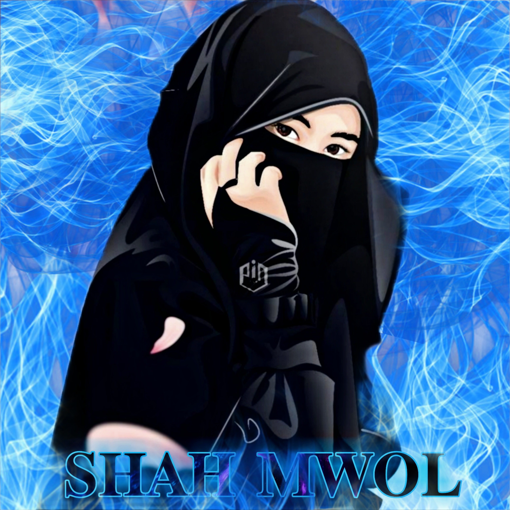

<div align="center">

## [](https://git.io/typing-svg)
[](https://app.fossa.com/projects/git%2Bgithub.com%2FOttapettavan%2FSHAH-MWOL?ref=badge_shield)

<h1 align="center">
   
</h1>
  <p align="center">
<a href="#"></a>
</p>
<p align="center">
       
<a href="https://github.com/Ottapettavan"></a>
</p>
<p></p>

<p>&nbsp;</p>
<p></p>
</p>

## Setup


  ### If there is an error deploying, try the following steps
  
1. If you dont have a github account create a account. Click [GIT HUB SIGN UP](https://github.com/signup/)

2. Open the WhatsApp account where you want to create the bot and go into the link device and SCAN the QR code Click [SCAN](https://replit.com/@Ottapettavan/Shahmwol?v=1)
 
3. If You don't have a account in [Heroku](https://signup.heroku.com/), Create a account.

4. You will have to fork this git to deploy via Heroku.
  click to fork the git into your account
 Click [FORK](https://github.com/Ottapettavan/SHAH-MWOL/fork)

5. Now https://heroku.com/deploy?template=https://github.com/Ottapettavan/SHAH-MWOL copy this url and change Ottapettavan with your github username and click go<br>
## 1. join what's app [bot] group 
<br>
<a href="https://chat.whatsapp.com/JPh6rmkqbuo2wdAXvKd7Jn"></a> 
   <br> 

## 2. Bot is not allowed here

 <br>
<a href="https://chat.whatsapp.com/F7p4E5x9972EcD9w6pAPYg"></a> 
   <br>
   
   
### ⚠️ Warning! 
```
Due to Userbot; Your WhatsApp account may be banned.
This is an open source project, you are responsible for everything you do. 
Absolutely, Asena executives do not accept responsibility.
By establishing the Asena, you are deemed to have accepted these responsibilities.
```


## License
This project is protected by `GNU General Public Licence v3.0` license.


[](https://app.fossa.com/projects/git%2Bgithub.com%2FOttapettavan%2FSHAH-MWOL?ref=badge_large)

### Disclaimer
`WhatsApp` name, its variations and the logo are registered trademarks of Facebook. We have nothing to do with the registered trademark
